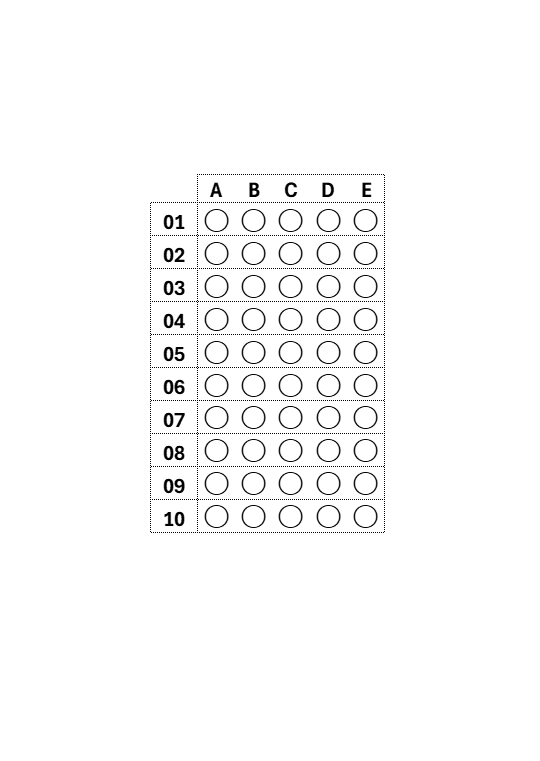
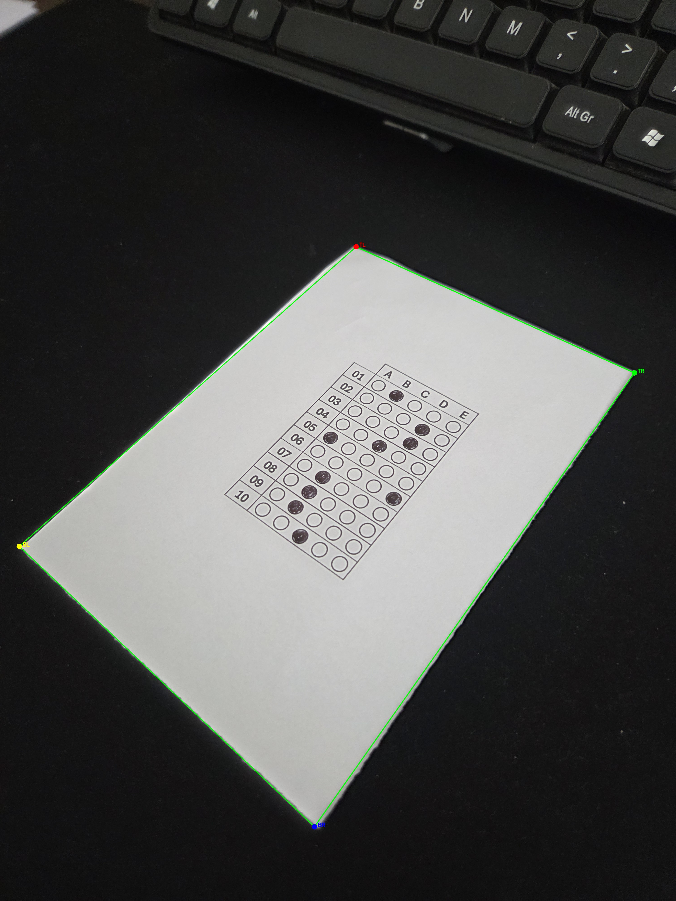
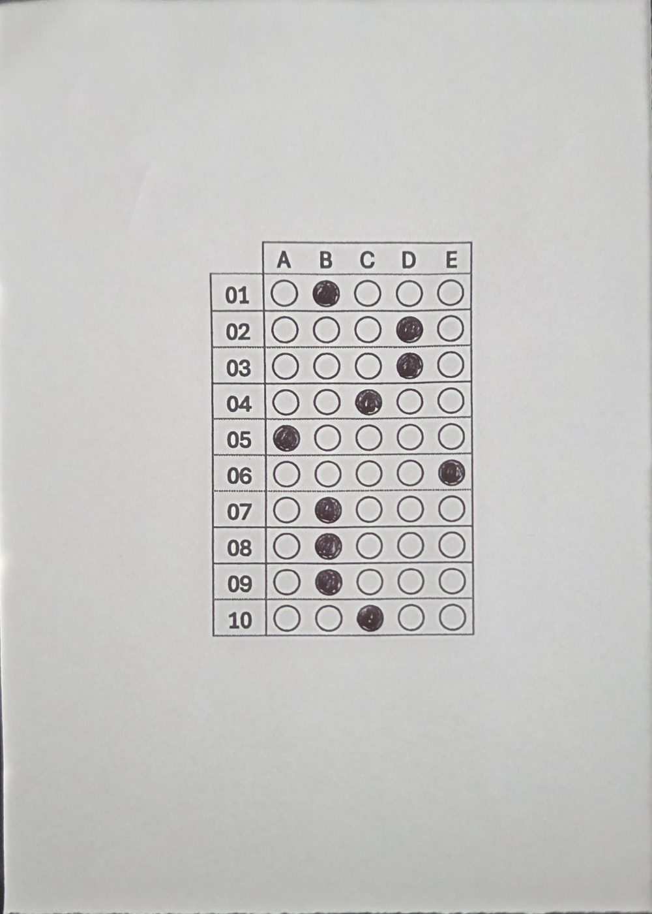
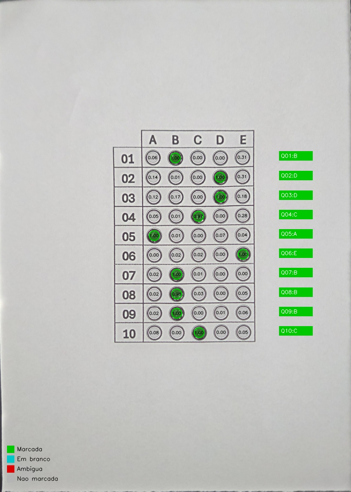
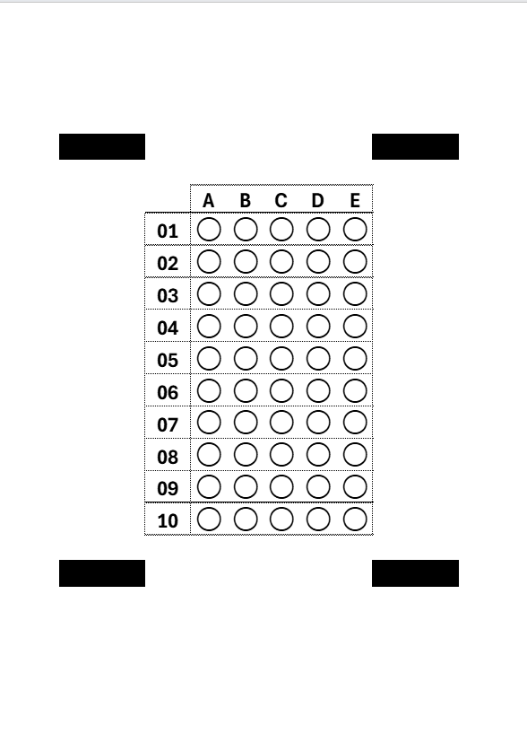

# Leitor Automático de Cartão-Resposta

Sistema de leitura automática de cartões-resposta desenvolvido em Python utilizando **exclusivamente técnicas clássicas de Processamento Digital de Imagens (PDI)** com OpenCV e NumPy.

> **Aviso:** Este é um projeto acadêmico simples, desenvolvido como trabalho final da disciplina de Processamento Digital de Imagens. O sistema não utiliza algoritmos complexos de Machine Learning (IA) e serve puramente para fins didáticos e demonstrativos das técnicas clássicas de manipulação de matrizes e detecção de bordas. Não é recomendado para uso em larga escala ou como um substituto comercial robusto.

---

## Sumário

1. [Objetivo](#objetivo)
2. [Instalação](#instalação)
3. [Como executar](#como-executar)
4. [Como deve ser a foto do cartão](#como-deve-ser-a-foto-do-cartão)
5. [Pipeline de PDI](#pipeline-de-pdi)
6. [Calibração das coordenadas das bolhas](#calibração-das-coordenadas-das-bolhas)
7. [Imagens de debug para o relatório](#imagens-de-debug-para-o-relatório)
8. [Módulo de comparação com gabarito (opcional)](#módulo-de-comparação-com-gabarito-opcional)
9. [Estrutura do projeto](#estrutura-do-projeto)
10. [Limitações conhecidas](#limitações-conhecidas)
11. [Por que a ausência de marcadores dificulta a detecção](#por-que-a-ausência-de-marcadores-dificulta-a-detecção)

---

## Objetivo

Receber uma **foto** de um cartão-resposta preenchido e retornar qual alternativa foi marcada em cada uma das questões, identificando também questões em branco e marcações ambíguas.

> **Nota sobre os Templates e Imagens:** 
> As imagens `template.png`, `template_marcadores.png` e todas as fotos na pasta `data/input` são **apenas exemplos** para fins de teste. O sistema não utiliza essas imagens de template para fazer comparações matemáticas durante a leitura. O padrão de exemplo utilizado no repositório é de um **cartão-resposta de 10 questões, com 5 alternativas cada (A a E)**. O algoritmo é calibrado automaticamente com base na grade impressa.

<p align="center">
  
</p>

---

## Instalação

**Pré-requisito:** Python 3.10 ou superior.

```bash
# Clone ou baixe o projeto
cd answer-sheet-reader

# (Recomendado) Crie um ambiente virtual
python -m venv .venv
.venv\Scripts\activate        # Windows
# source .venv/bin/activate   # Linux/macOS

# Instale as dependências
pip install -r requirements.txt
```

---

## Como executar

### Leitura básica

```bash
python main.py --image data/input/cartao01.jpg
```

### Com gabarito oficial (opcional)

```bash
python main.py --image data/input/cartao01.jpg --gabarito "1-A,2-C,3-D,4-B,5-E,6-A,7-C,8-B,9-D,10-E"
```

### Pular correção de perspectiva (imagem já alinhada)

```bash
python main.py --image data/input/cartao01.jpg --no-warp
```

### Todos os parâmetros

```
--image       Caminho da imagem (obrigatório)
--gabarito    Gabarito oficial em string (opcional)
--config      Caminho alternativo para sheet_config.json
--no-warp     Pula a correção de perspectiva
--auto-calibrate Detecta posições das bolhas dinamicamente (ignora json)
--debug-dir   Diretório de debug (padrão: data/debug)
--output-dir  Diretório de saída (padrão: data/output)
```

### Exemplo de saída no terminal

```
════════════════════════════════════════════════════════════
  LEITURA DO CARTÃO-RESPOSTA
════════════════════════════════════════════════════════════
  Questão │ Resposta lida   │ Confiança / Preenchimento
────────────────────────────────────────────────────────────
    01    │       A         │ 0.72
    02    │       C         │ 0.68
    03    │  EM_BRANCO      │ 0.05
    04    │       D         │ 0.81
    05    │  AMBIGUA        │ A=0.61, B=0.58
    06    │       E         │ 0.74
    07    │       B         │ 0.69
    08    │       A         │ 0.83
    09    │       D         │ 0.77
    10    │       C         │ 0.71
════════════════════════════════════════════════════════════
```

### Arquivos de saída gerados

| Arquivo | Descrição |
|---|---|
| `data/output/respostas_lidas.json` | Resultados completos em JSON |
| `data/output/respostas_lidas.csv`  | Resultados em CSV |
| `data/debug/01_original.jpg` a `08_bubbles_debug.jpg` | Imagens de debug |

---

## Como deve ser a foto do cartão

Para a detecção automática de perspectiva funcionar corretamente:

| ✅ Recomendado | ❌ Evitar |
|---|---|
| Fundo escuro ou colorido (mesa escura, cartolina) | Fundo branco ou claro |
| Iluminação uniforme, sem sombras | Flash direto com reflexo |
| Folha completamente visível na foto | Folha cortada nas bordas |
| Inclinação máxima de ~30° | Ângulo muito oblíquo |
| Foto nítida, sem desfoque de movimento | Imagem borrada |

> **Dica:** Colocar a folha sobre uma mesa preta ou cartolina escura é a forma mais fácil de garantir bom contraste e detecção automática.

Se a imagem já estiver alinhada (escaneada ou foto frontal), use `--no-warp` para pular a etapa de perspectiva.

---

## Pipeline de PDI

```
Imagem original
     │
     ▼
[1] Conversão para tons de cinza (cv2.cvtColor)
     │
     ▼
[2] CLAHE — Equalização adaptativa de histograma
     │       Corrige iluminação não-uniforme (sombras, flash)
     ▼
[3] Blur gaussiano (5×5) + Canny
     │       Detecta bordas da folha
     ▼
[4] Detecção do contorno externo
     │       findContours → approxPolyDP → quadrilátero válido
     ▼
[5] Transformação perspectiva (homografia)
     │       getPerspectiveTransform + warpPerspective → 1000×1400 px
     ▼
[6] CLAHE + Limiarização adaptativa (sobre a imagem corrigida)
     │       Segmenta pixels marcados de pixels não marcados
     ▼
[7] Análise de 50 bolhas por coordenadas fixas
     │       Máscara circular interna + contagem de pixels pretos
     ▼
[8] Regra de decisão por questão
     │       EM_BRANCO / AMBIGUA / Alternativa com maior fill ratio
     ▼
Resultados (terminal + JSON + CSV) + 8 imagens de debug
```

---

## Calibração das coordenadas das bolhas

As coordenadas das bolhas ($X$ e $Y$) podem ser obtidas de duas formas:

### 1. Calibração Automática (Recomendado)
Use a flag `--auto-calibrate` ao executar o script. O sistema usará a Transformada de Hough para detectar as bolhas impressas na imagem corrigida e inferir dinamicamente a posição do grid, sem precisar editar nenhum arquivo manualmente.

```bash
python main.py --image data/input/cartao01.jpg --auto-calibrate
```

### 2. Calibração Manual (Fallback)
Caso a calibração automática falhe por problemas de impressão na foto, você pode definir as coordenadas fixas em `config/sheet_config.json`.

1. Execute o sistema para gerar a imagem `data/debug/06_warped.jpg`.
2. Use um editor de imagem (Paint, Photoshop) para medir o centro (X, Y) das bolhas em pixels.
3. Atualize os valores `x_positions` (colunas A a E) e `y_positions` (linhas 1 a 10) no JSON.
4. Execute o script sem a flag `--auto-calibrate`.

### Parâmetros ajustáveis

| Parâmetro | Descrição | Padrão |
|---|---|---|
| `warped_width` / `warped_height` | Dimensão da imagem corrigida | 1000 × 1400 |
| `bubble_radius` | Raio matemático da bolha impressa | 22 (A4) / 45 (Marcadores) |
| `inner_mask_radius` | Raio da máscara interna de análise | 15 (A4) / 33 (Marcadores) |
| `min_fill_ratio` | Limiar de Validade: mínimo de tinta para considerar a bolha marcada | 0.50 (50%) |
| `min_ink_ratio` | Limiar de Sujeira: mínimo de tinta na 2ª alternativa para acusar AMBIGUIDADE (ex: detectar "X" ou rasura) | 0.20 (20%) |
| `x_positions` | Centro X de cada coluna (A-E) na imagem corrigida | ver JSON |
| `y_positions` | Centro Y de cada linha (1-10) na imagem corrigida | ver JSON |

---

## Imagens de debug para o relatório

| Arquivo | Conteúdo | Uso no relatório |
|---|---|---|
| `01_original.jpg` | Foto original carregada | Mostrar imagem de entrada |
| `02_gray.jpg` | Conversão para tons de cinza | Etapa 1 do pipeline |
| `03_clahe.jpg` | Após CLAHE (correção de iluminação) | Demonstrar efeito do CLAHE |
| `04_edges_or_threshold.jpg` | Bordas Canny (detecção do contorno) | Mostrar detecção de bordas |
| `05_contour_detected.jpg` | Contorno detectado desenhado sobre a foto original | Validação da detecção |
| `06_warped.jpg` | Imagem após correção de perspectiva | Demonstrar homografia |
| `07_threshold_warped.jpg` | Limiarização adaptativa da imagem corrigida | Etapa de binarização |
| `08_bubbles_debug.jpg` | Bolhas analisadas com resultado visual por questão | Resultado final visual |

### Exemplos Visuais do Pipeline

Abaixo estão alguns exemplos das imagens geradas na pasta `data/debug/` durante o processamento de uma foto inclinada (`normal_5.jpg`):

**1. Detecção do Contorno (05_contour_detected.jpg)**  
*(O sistema detecta a folha mesmo em ângulos oblíquos)*
<p align="center"></p>

**2. Correção de Perspectiva (06_warped.jpg)**  
*(Aplica-se a homografia para "desentortar" e chapar a folha)*
<p align="center"></p>

**3. Análise Final das Bolhas (08_bubbles_debug.jpg)**  
*(Bolhas detectadas matematicamente pelo threshold)*
<p align="center"></p>

### Legenda do `08_bubbles_debug.jpg`

- 🟢 **Verde:** alternativa marcada e selecionada como resposta
- 🟡 **Amarelo:** questão em branco (nenhuma bolha passou do limiar)
- 🔴 **Vermelho:** questão ambígua (duas ou mais bolhas próximas do limiar)
- ⚪ **Cinza:** bolha não marcada

---

## Módulo de comparação com gabarito (opcional)

O módulo `reader/grading.py` compara as respostas lidas com um gabarito oficial:

```bash
python main.py --image data/input/cartao01.jpg \
  --gabarito "1-A,2-C,3-D,4-B,5-E,6-A,7-C,8-B,9-D,10-E"
```

Saída adicional:

```
════════════════════════════════════════════════════════
  COMPARAÇÃO COM GABARITO OFICIAL
════════════════════════════════════════════════════════
  Questão  │  Lida    │ Gabarito │  Status
────────────────────────────────────────────────────────
    01     │    A     │    A     │ ✓ CERTO
    02     │    C     │    C     │ ✓ CERTO
    03     │ EM_BRANCO│    D     │ ✗ ERRADO
    ...
  Resultado: 8/10 (80.0%)
════════════════════════════════════════════════════════
```

O sistema funciona **sem gabarito**; esta funcionalidade é puramente opcional.

---

## Estrutura do projeto

```
answer-sheet-reader/
├── main.py                  # Ponto de entrada e pipeline principal
├── requirements.txt         # Dependências Python
├── README.md
├── config/
│   └── sheet_config.json    # Parâmetros ajustáveis do cartão
├── reader/
│   ├── __init__.py
│   ├── preprocessing.py     # Tons de cinza, CLAHE, limiarização
│   ├── perspective.py       # Detecção de contorno e homografia
│   ├── bubbles.py           # Análise de bolhas e regra de decisão
│   ├── output.py            # Saída no terminal, JSON e CSV
│   ├── visualization.py     # Imagens de debug
│   └── grading.py           # Comparação com gabarito (opcional)
└── data/
    ├── input/               # Coloque as fotos do cartão aqui
    ├── output/              # Resultados: JSON e CSV
    └── debug/               # 8 imagens de debug do pipeline
```

---

## Limitações conhecidas

1. **Dependência de contraste fundo/folha:** Sem marcadores de canto, o sistema depende de contraste visual entre a folha branca e o fundo para detectar a perspectiva. Fundos brancos ou com pouco contraste causam falha.

2. **Calibração manual necessária:** As coordenadas das bolhas (`x_positions`, `y_positions`) devem ser calibradas uma vez para cada modelo de cartão impresso. Variações de impressora ou escala afetam os valores.

3. **Múltiplas marcações por questão:** O sistema detecta ambiguidade, mas não determina intenção do aluno. Questões ambíguas são reportadas como `AMBIGUA`.

4. **Iluminação muito não-uniforme:** O CLAHE corrige variações suaves, mas iluminação extremamente desigual (sombra sobre metade do cartão) pode prejudicar a leitura.

5. **Resolução mínima:** Imagens com resolução muito baixa (abaixo de 800×600) podem dificultar a detecção das bordas das bolhas.

6. **Caneta ou lápis:** O sistema funciona com lápis (grafite) e caneta escura. Marcações muito claras (lápis 4H ou mais) podem ficar abaixo do limiar `min_fill_ratio`.

---

## 🚀 Suporte a Gabarito com Marcadores (NOVO)

<p align="center">
  
</p>

**A Motivação:**
Algoritmos clássicos de Visão Computacional (como o detector de bordas *Canny*) não usam Inteligência Artificial para entender o que é um papel. Eles procuram por "degraus de luz" (Gradientes) na imagem. 
Se você fotografar uma folha branca em cima de uma mesa branca ou muito clara, os pixels da mesa e os da folha terão a mesma cor. O degrau de luz não existe. Para o computador, a mesa e o papel se fundem em um único objeto e a detecção do contorno falha miseravelmente.

Para resolver isso em definitivo, o sistema agora conta com a arquitetura **Dual-Pipeline**!

A solução foi colocar 4 quadrados pretos impressos nos cantos do papel. Como o quadrado preto está impresso sobre o papel branco, o contraste interno é sempre máximo e absoluto (preto no branco), independentemente da folha estar sobre uma mesa branca, um sofá colorido ou até flutuando no ar.

Ao usar gabaritos com marcadores, execute o sistema com a flag:

```bash
python main.py --image data/input/cartao_marcadores.jpg --auto-calibrate --use-markers
```

**Vantagens do modelo com marcadores:**
- Imunidade total à cor da mesa ou ao fundo da foto.
- Calibração geométrica perfeita (pois os quadrados são sempre estáticos em relação às bolhas).
- O sistema corta a imagem de forma precisa ao redor da grade, dando um "zoom" óptico nas bolhas.

Caso você omita a flag `--use-markers`, o sistema tentará o modelo clássico de Canny e Filtro Bilateral para detectar as bordas físicas da folha de papel. (Atenção: evite fotografar folhas brancas em mesas brancas!). Adicionamos também um corretor de rotação angular (`arctan2`) que impede distorções de perspectiva extremas (como papéis parecendo losangos).

---

## Referências técnicas

- OpenCV Documentation: https://docs.opencv.org
- Gonzalez & Woods — *Digital Image Processing*, 4ª ed.
- CLAHE: Zuiderveld, K. (1994). *Contrast limited adaptive histogram equalization.*
